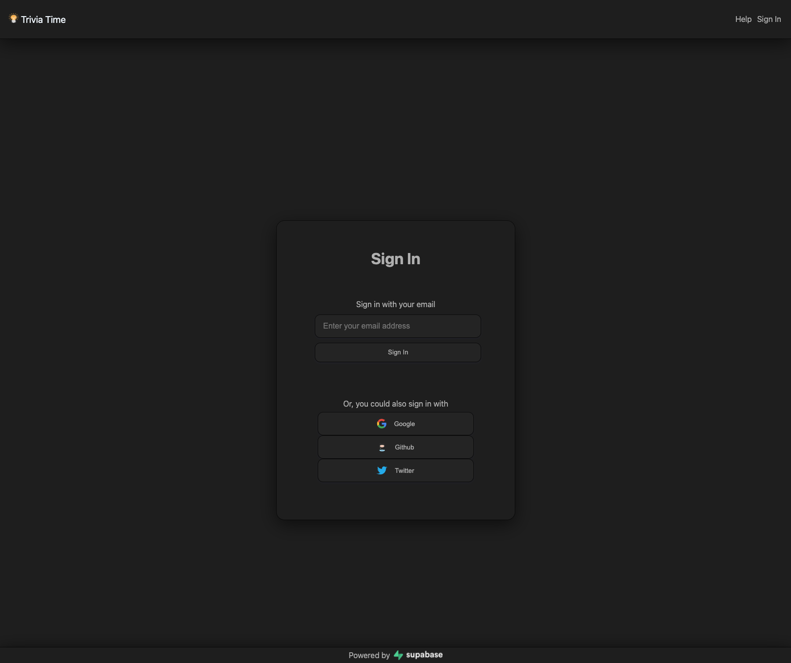
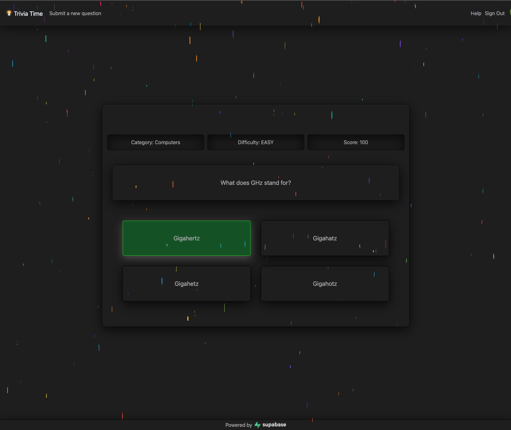
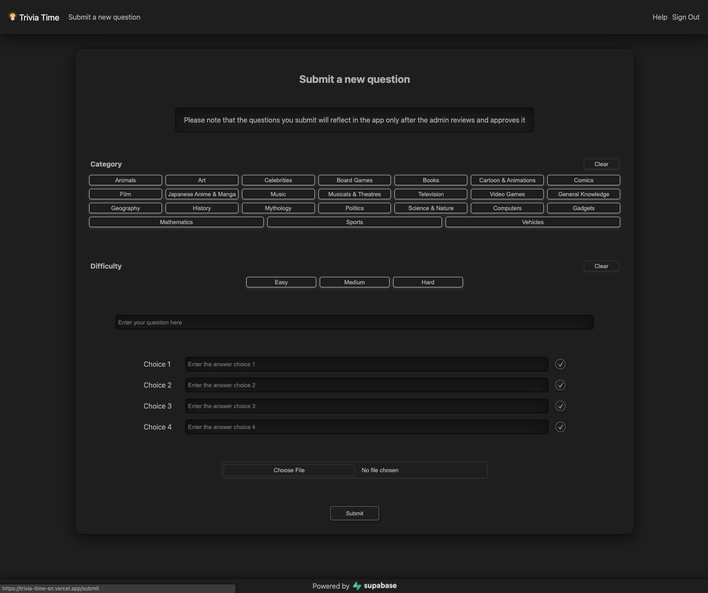
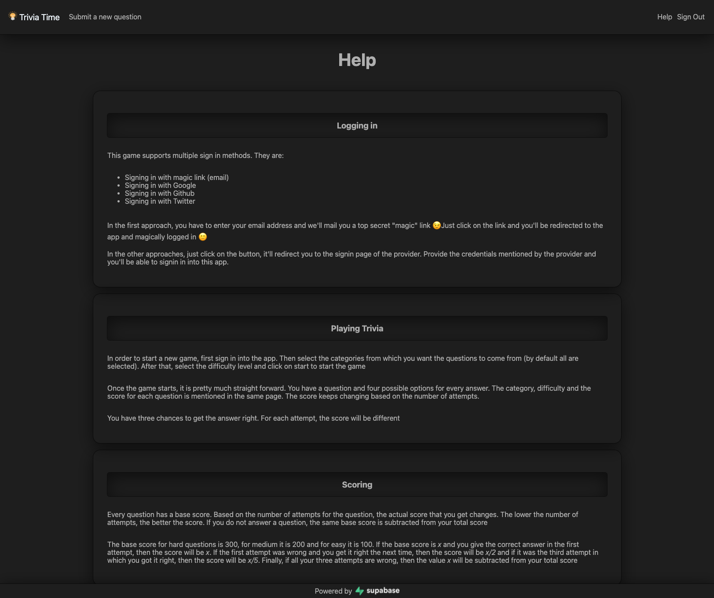

# Trivia Time

Welcome to Trivia Time!. This is a Trivia game built using Supabase, Next.js and other technologies.

The base set of questions are from the [Open Trivia Database](https://opentdb.com/), but there are some new questions added. There is also an option to submit new questions.

## View the project live
I've used [Vercel](https://vercel.com/) to deploy the app. You can access it over here: [https://trivia-time-sn.vercel.app](https://trivia-time-sn.vercel.app/)


## Screenshots












## Features supported
- Login with email, Google, Github and Twitter
- Over 3k questions from 20+ categories and various difficulty levels
- Start a new game with any of the selected categories and difficulty level
- View your previous game scores, and see the list of top 20 players worldwide
- Play an unlimited number of times
- Dark mode

## Features planned
- Allow questions to use files other than images (like a video/sound clip)
- Enhance the user profile to add avatar, nick name etc
- Capability to host competitions/tournaments to compete with a set of people
- Bulk upload of questions in excel/json format
- Integrate with other auth providers


## Running the app locally
This project uses Next.js. So running the project locally would need the following steps:
1. Create an environment file _.env.local_ in the root directory and add the following details into it:
   ```
   NEXT_PUBLIC_SUPABASE_URL={Your supabase url}
   NEXT_PUBLIC_SUPABASE_ANON_KEY={Your anon key}
   ```
2. Create the required tables in supabase.io and enable authorization with email
3. Run the app in _dev mode_ using `npm run dev` or in _production mode_ using `npm build && npm start`


## Supabase features used
This project relies on Supabase for almost each part of it.
1. All the _questions, sessions, profile data, scores_ etc are all stored using **Supabase tables**. (the reason why I migrated the questions from opentrivia db to Supabase is because I had to edit some of the questions that they had, and also add more questions to the list)
2. The _Authentication and profile management_ in the app is handled using **Supabase auth**. For now, I've used only magic url, Google, Github and Twitter as sign in methods, but I plan to enhance it.
3. The _images needed for the questions_ are stored using **Supabase storage**. For now, this is applicable only for new question submissions, as the existing questions in Open Trivia DB does not have any images.


## Contributors
- Sarath S ([Github](https://gthub.com/sarathm09), [Twitter](https://twitter.com/sskuttu))

